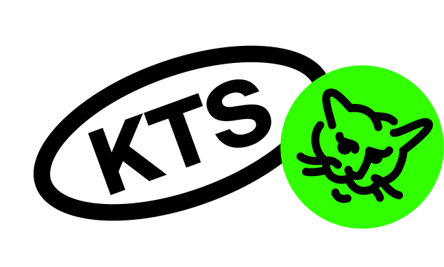

# @ktsstudio/mediaproject-vk

Пакет с утилитами для медиапроектов vk-mini-app.

### Использование

`npm install @ktsstudio/mediaproject-vk`

`yarn add @ktsstudio/mediaproject-vk`

### О пакете

Содержит обертки для некоторых методов vk-bridge. 
Также содержит [метод-обертку для работы VK API через vk-bridge](./src/vkApi.ts) и [утилиту для инициализации параметров vk-приложения](./src/initializeVkApp.ts)
с использованием GET-параметров. Хранит параметры приложения в [Window](./src/types/window.ts).

#### Методы-обертки для vk-bridge:

- [addToFavorites](./src/addToFavorites.ts) - добавление приложения в список избранных (VKWebAppAddToFavorites)
- [allowMessagesFromGroup](./src/allowMessagesFromGroup.ts) - запрос у юзера разрешения на получение сообщений от сообщества (VKWebAppAllowMessagesFromGroup)
- [allowNotifications](./src/allowNotifications.ts) - запрос у юзера разрешения на отправку уведомлений от приложения (VKWebAppAllowNotifications)
- [getAuthToken](./src/getAuthToken.ts) - получение access token юзера (VKWebAppGetAuthToken)
- [getUserInfo](./src/getUserInfo.ts) - получение данных юзера, открывшего приложение (VKWebAppGetUserInfo)
- [setSwipeSettings](./src/setSwipeSettings.ts) - включение swipeBack (VKWebAppSetSwipeSettings)
- [setViewSettings](./src/setViewSettings.ts) - установка вида statusbar, actionbar, navigationbar на мобильных устройствах (VKWebAppSetViewSettings)
- [shareLink](./src/shareLink.ts) - поделиться ссылкой (VKWebAppShare)
- [sharePost](./src/sharePost.ts) - поделиться постом на стену (VKWebAppShowWallPostBox)
- [shareStory](./src/shareStory.ts) - поделиться историей (VKWebAppShowStoryBox)
- [vibrateAsImpact, vibrateAsNotification, vibrateAsSelection](./src/vibrate.ts) - утилиты-обертки над методами вибраций (VKWebAppTapticImpactOccurred, VKWebAppTapticNotificationOccurred, VKWebAppTapticSelectionChanged)
- [vkApi](./src/vkApi.ts) - вызвать метод vk api (VKWebAppCallAPIMethod)

#### Другие методы:

- [checkIOS](./src/checkIOS.ts) - метод для проверки, является ли текущая платформа IOS на основе параметра платформы, получаемого при инициализации VK-приложения
- [initializeVkApp](./src/initializeVkApp.ts) - утилита для инициализации параметров vk-mini-app

### Обратная связь

Любой фидбэк вы можете передать нам на почту [hello@ktsstudio.ru](mailto:hello@ktsstudio.ru) в письме с темой "mediaproject-vk feedback"
